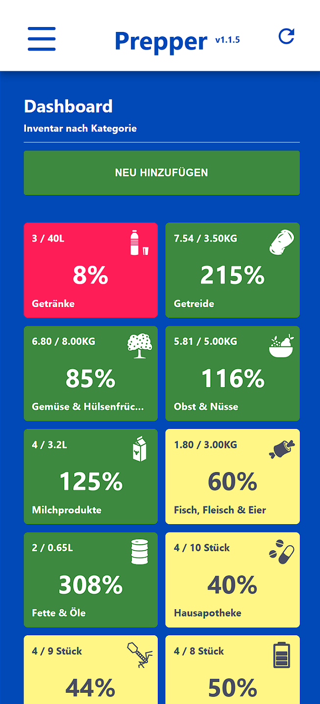
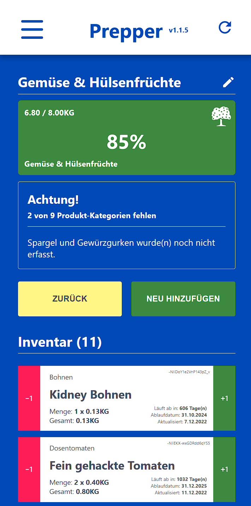
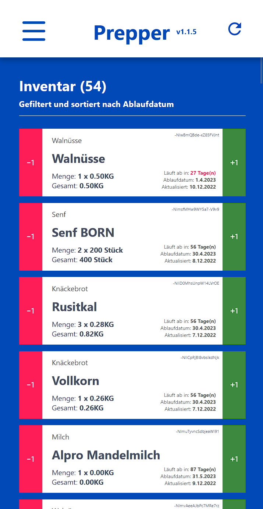
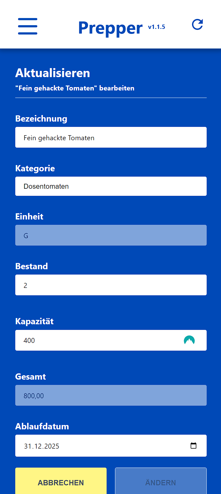

# The Prepper

Simple Headless-Frontend-Application which helps preparing for the worst! Inspired by the "adviser-emergency-care-checklist" by the Bundesamt für Bevölkerungsschutz und Katastrophenhilfe.

## Screenshots

    
    
    
    

## Functionality

- Calculate amounts and thresholds for food and drinks based on guideance and people
- Track expiry dates
- Increase & decrease amounts with just one touch
- Get alert's for missing products
- Manage categories, sub-categories, goals and units
